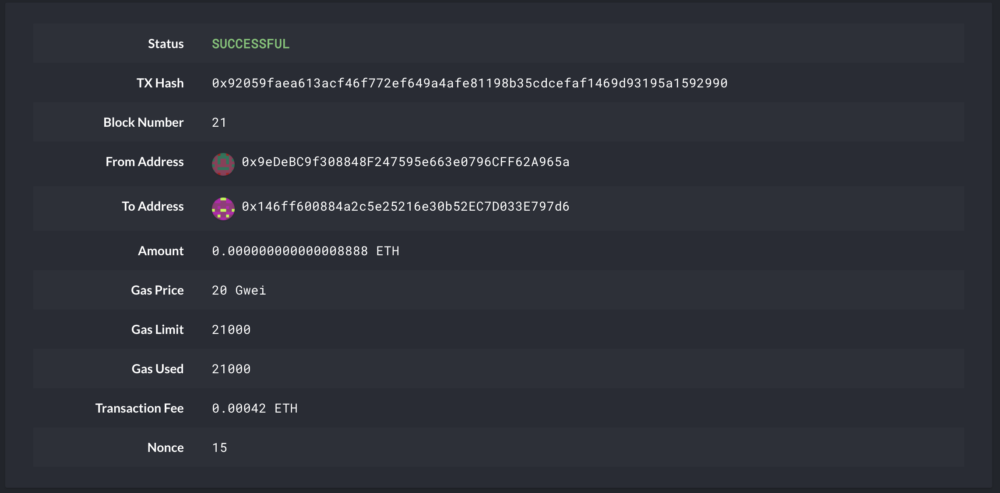
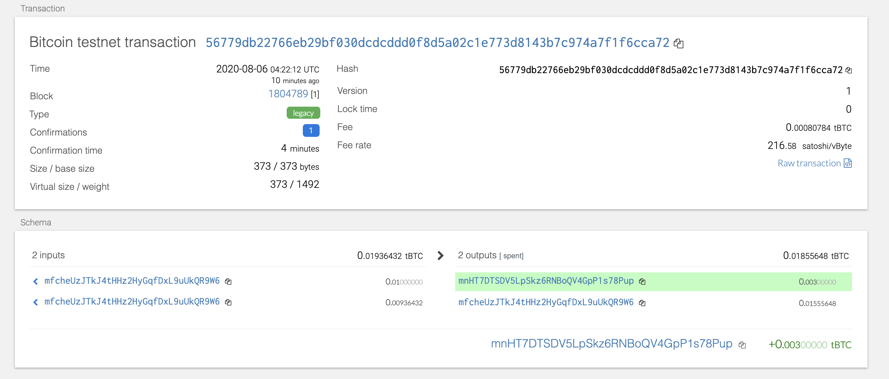

# blockchain_python

I am in a race to get to the market.  It's
a good thing I understand how HD wallets work. There aren't as many tools available in Python for this sort of thing, yet.
Thankfully, I've found a command line tool, hd-wallet-derive that supports not only BIP32, BIP39, and BIP44, but
also supports non-standard derivation paths for the most popular wallets out there today! 

I integrate
the script into your backend with Python.
Once you've integrated this "universal" wallet, I can begin to manage billions of addresses across 300+ coins, giving
you a serious edge against the competition.

In this repository, I demonstrate on how to get 2 coins working: Ethereum and Bitcoin Testnet.

Check the "Wallet" Python code.

below is the succsessful transaction screenshot

## ETH Transaction

## BTC Test Transaction
